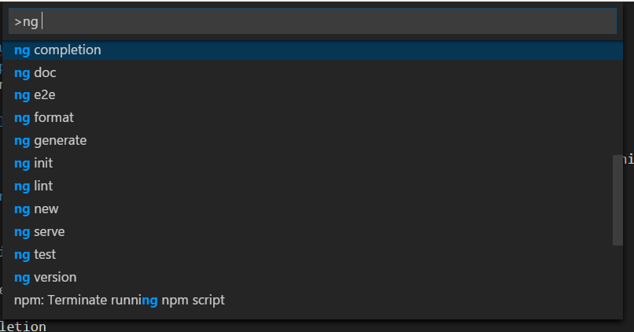

# vsc-angular-cli

## a wrapper for angular-cli commands
So you can run angular-cli commands directly from cscode commandpannel.

## Install

In Visual Studio Code, run  ext install vsc-angular-cli  - or, simply hit  CMD/CTRL + Shift + P , search for "Install Extension", and then search for "angular-cli".

### Supported commands (by now):

### backlog.
* ng get
* ng set
* ng github-pages:deploy

**Enjoy!**

